# CaseHUB

### 接口 & UI 自动化平台

[](https://www.python.org/)
[](https://www.python.org/)
[](https://www.python-httpx.org/)
[](https://playwright.dev/python/docs/api/class-playwright)
[]()
[]()

---

## 🚀 功能特点

### 接口自动化能力

✨ **核心功能**：

- **基础 HTTP 请求**：支持多种 HTTP 请求类型（GET、POST、PUT、DELETE 等）。
- **变量提取与写入**：可从响应中提取变量，支持在后续请求中使用。
- **断言功能**：提供响应状态码、内容等多种断言验证。
- **前后置脚本**：在用例执行前后执行自定义 Python 脚本。
- **各种函数变量写入**：在用例执行前后执行自定义函数变量。
- **调试模式**：逐步执行测试用例，便于精准排查问题。
- **用例执行**：支持单个或批量用例的执行。
- **定时任务**：定时执行接口测试任务，适用于定期测试。
- **报告展示**：自动生成并展示 HTML 格式的测试报告，明确显示成功与失败的详细信息。
- **实时日志可视化**：在测试执行过程中实时展示日志，便于进度监控。
- **接口录制（未完善）**：录制接口请求并快速生成对应的测试用例。（感觉不好用、思路不是很对）

### UI 自动化功能

✨ **Playwright 集成**：

- **UI 自动化支持**：集成了 Playwright，能够执行浏览器自动化测试，模拟用户操作界面。
- **步骤录入**：支持在 UI 测试中录入测试步骤，便于快速创建测试用例。
- **前后置接口请求**：每个步骤可与前后置接口请求结合，动态调整测试流程。
- **全局变量**：支持全局变量的管理，步骤和请求中的变量可以全局共享，方便管理和使用。
- **公共步骤编辑**：支持创建和管理公共步骤，可以重复使用，减少冗余，提升效率。
- **任务管理**：与接口测试类似，UI 测试任务支持定时执行与结果推送，支持企业微信等推送方式。
- **SQL 支持（未完成）**：计划在未来版本中支持 SQL 操作，增强数据处理能力。
- **IF 条件判断执行**：支持根据条件判断执行特定步骤，灵活控制测试流程。

---

## 🖥️ UI 展示

#### [前端项目地址](https://github.com/Caoyongqi912/caseHubWeb)

### 📊 首页数据展示

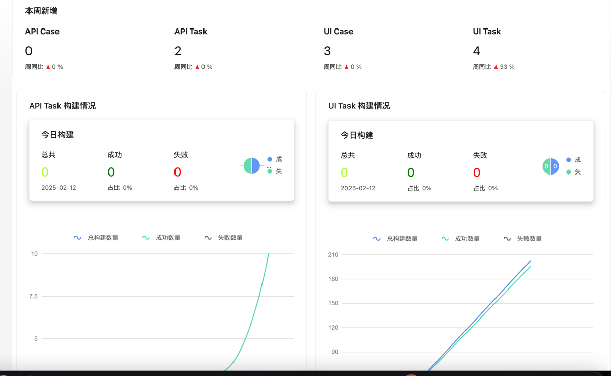

### 📊 **API 列表**

展示所有接口的概览：

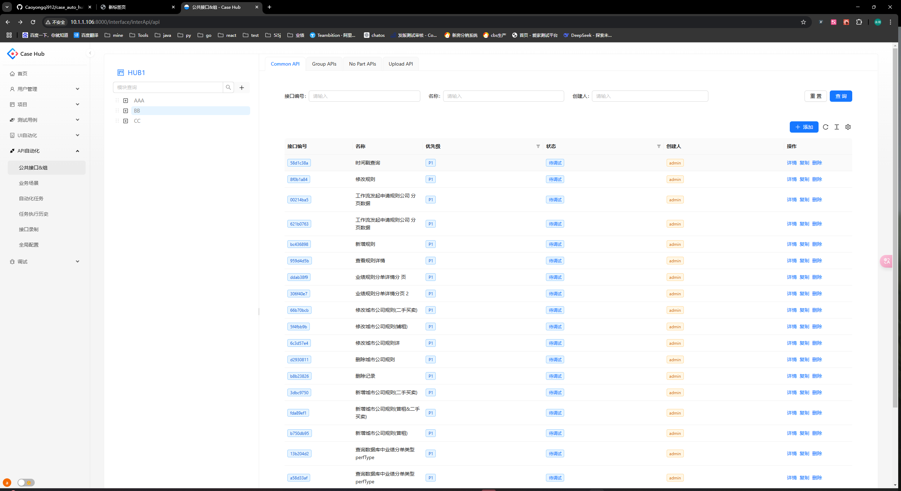

---

### 🔍 **API 详情**

查看单个接口的详细信息

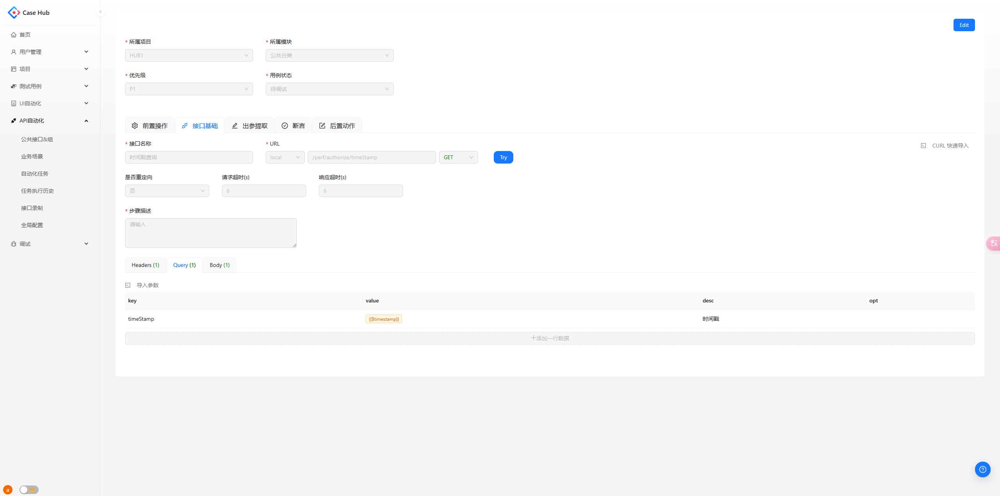

---

### **前置操作**

-  **前置变量**
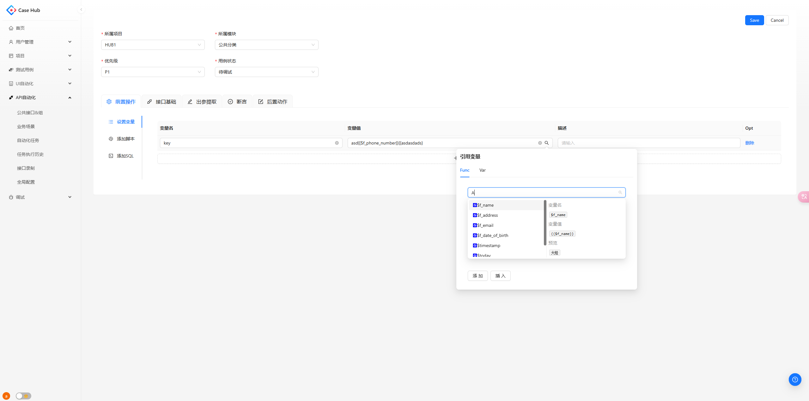
- **前置脚本** 
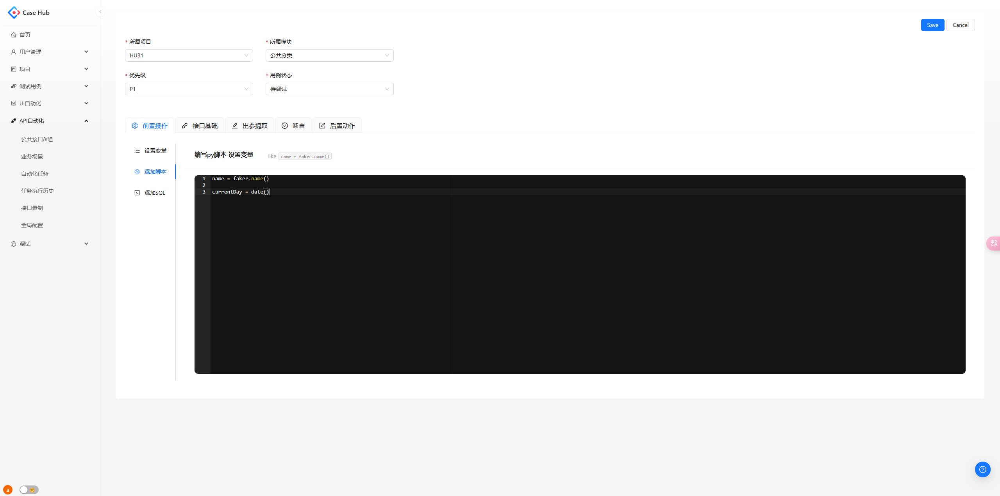
- **SQL执行**
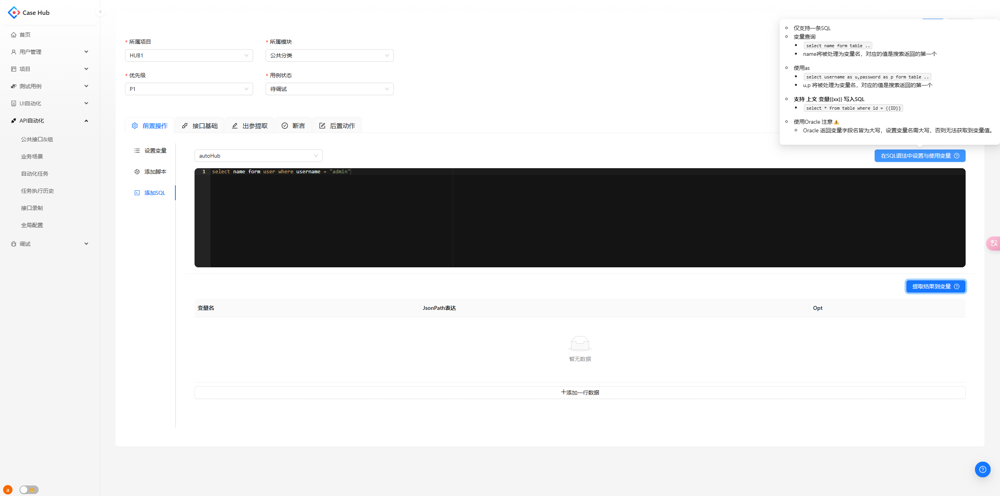


- **响应提取**
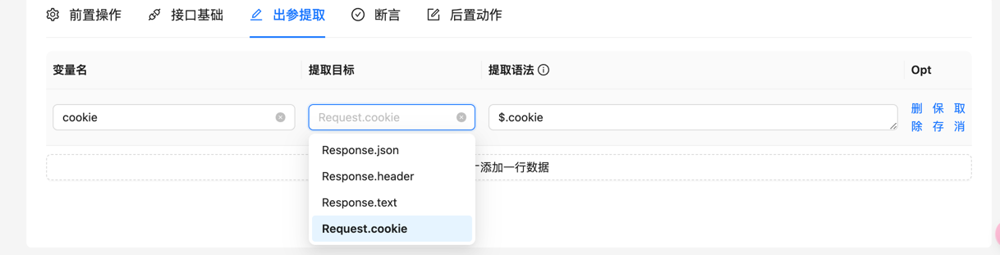

- **接口断言**
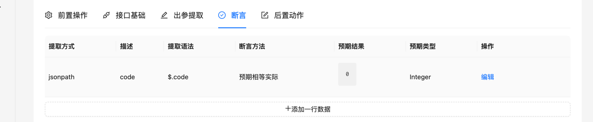

- **变量写入支持**
  - url
  - header
  - query
  - body
  - exec sql

   
   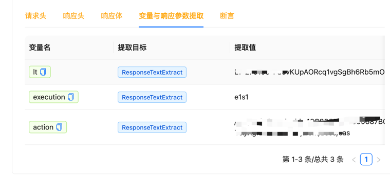

-  **“引用变量”能力**
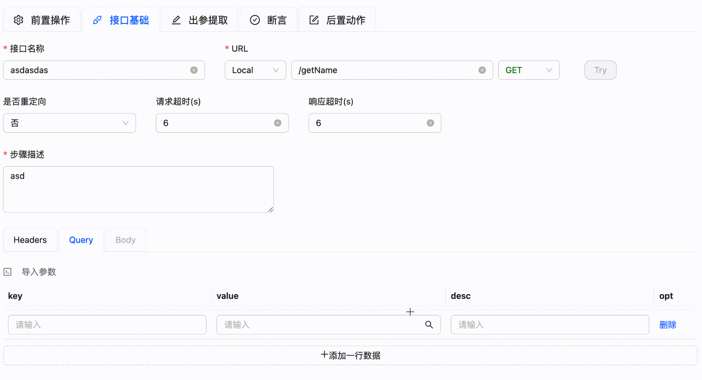

- **CURL解析导入**
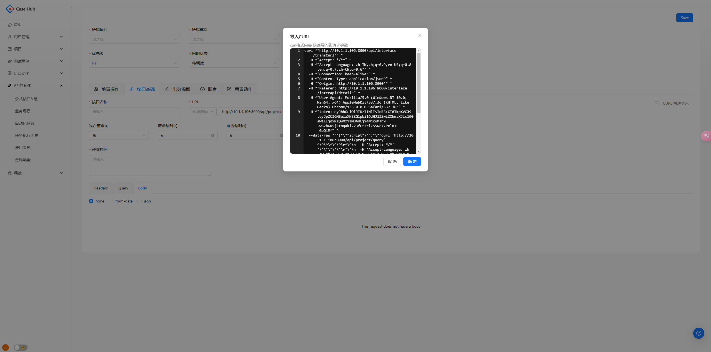
### 🖱️ **APITry**

支持在 UI 中直接执行接口请求，快速验证 API 可用性：

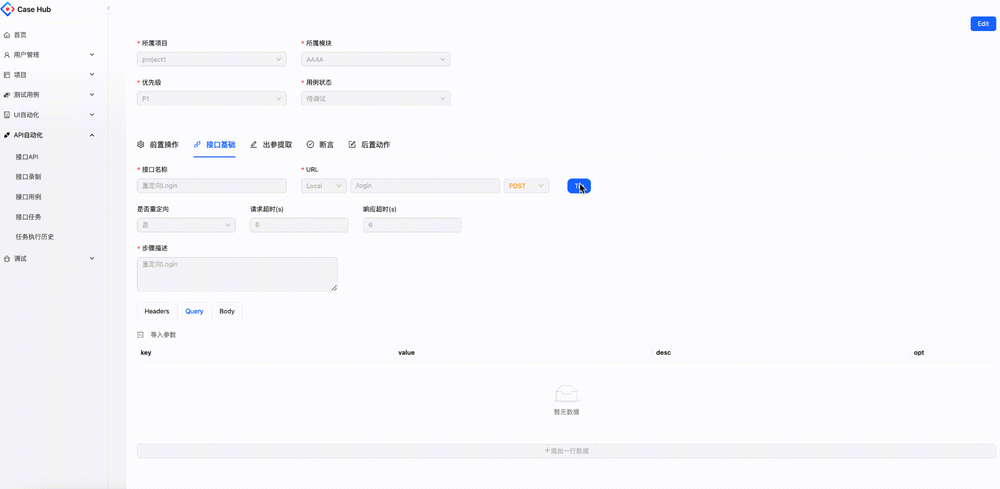

---

### ➕ **Case 添加 API**

支持：

- 添加公共 API
- 手动录入 API
- 添加 API GROUP
- API 执行拖拽排序
- 支持基本的 CRUD 操作


---

### ⚡ **RunCase 执行用例**

- **同步执行**：实时展示测试日志，确保每个步骤都可监控。

  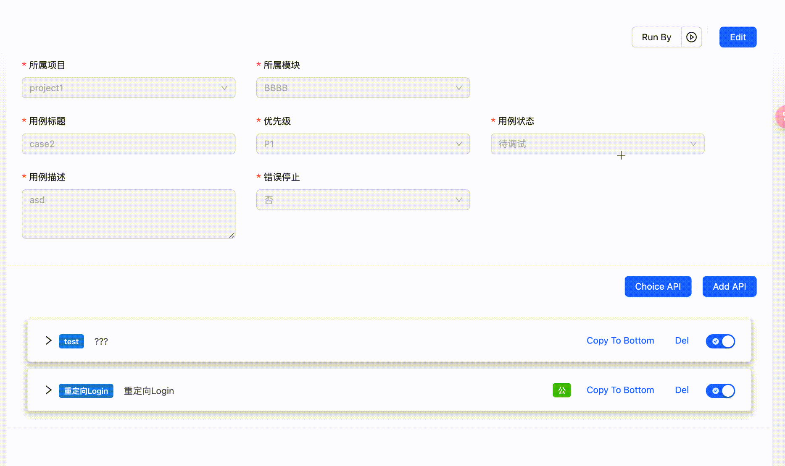

- **后台执行 & 轮询结果**：适用于长期任务或需要在后台执行的测试。

  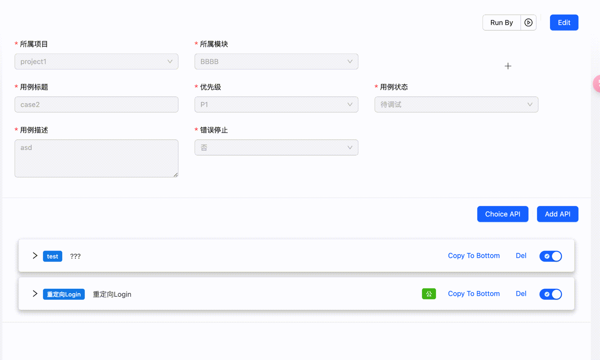

---

### 📅 **Task 接口任务**

任务可关联多个 API 用例，支持：

- 定时任务执行
- 执行结果推送（目前支持企业微信）

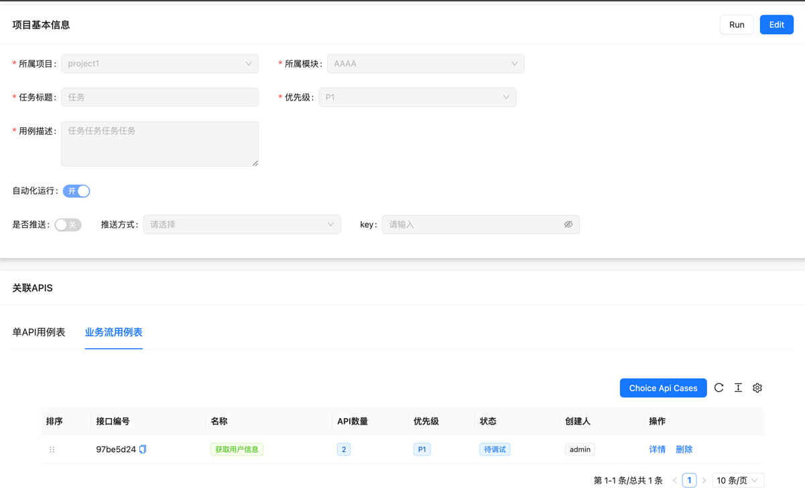

---

### 📈 **Task 任务报告**

生成并展示任务执行后的详细报告，帮助团队了解测试状态。

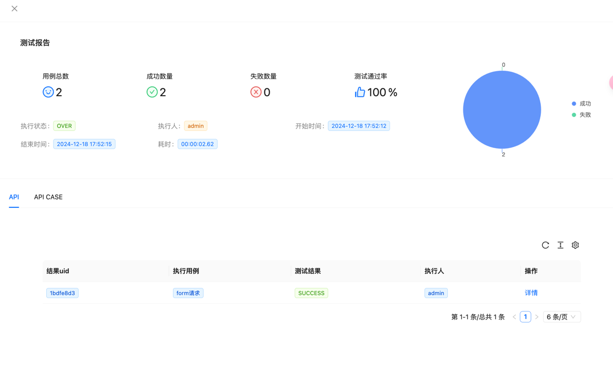

## UI 自动化

- 支持配置方法、环境、公共步骤、操作任务的调度
- UI 执行步骤前后置接口请求、SQL（未完成）、IF 条件判断执行
- 步骤拖拽排序


---

## 🛠️ 安装与使用

### 安装依赖

1. 环境准备
    - MYSQL
        - 创建一个database 'autoHub'
    - REDIS
    - Python 3.12
        - env `pip install requirment.txt`

2. 配置文件

    - 配置自己的数据库等相关内容
    - 编辑 `config.py`，根据本地情况进行自定义
    - 初始化数据到数据库 执行 `script/initSQL.sql`
   
    ```python 
    MYSQL_DATABASE = 'autoHub' # dbtabase
    
    class LocalConfig(BaseConfig):
        SERVER_HOST: str = "127.0.0.1" # or ur ip
        SERVER_PORT: int = 5050
        
        APS = False # 是否开启定时任务
        Record_Proxy = False # 是否开启代理录制
        
        MYSQL_SERVER = "127.0.0.1" # 数据库IP 
        MYSQL_PASSWORD = "your password" # 数据库密码
    
        # redis
        REDIS_DB = 0
        REDIS_SERVER = "127.0.0.1"
        REDIS_URL: str = f"redis://{REDIS_SERVER}:{BaseConfig.REDIS_PORT}/{REDIS_DB}"
        # Oracle 客户端 链接oracle 可能需要用的
        CX_Oracle_Client_Dir = "/your/instantclient_23_3"
        
    ```
3. 启动项目
    - `main.py`
      - 一些钩子函数
      - 初始化db （项目启动自动建表）
      - 初始化aps 是否启动定时任务
      - 初始化redis 连接redis
      - 代理 
    - `run.py`
      - 右键直接运行

5.前端部署见 [前端项目](https://github.com/Caoyongqi912/caseHubWeb)

6. 其他先自行探索吧 


> 存在疑问？联系我
>
